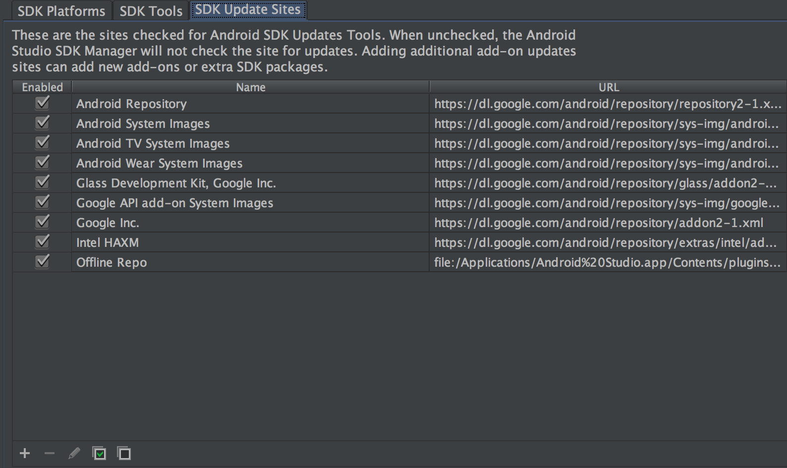
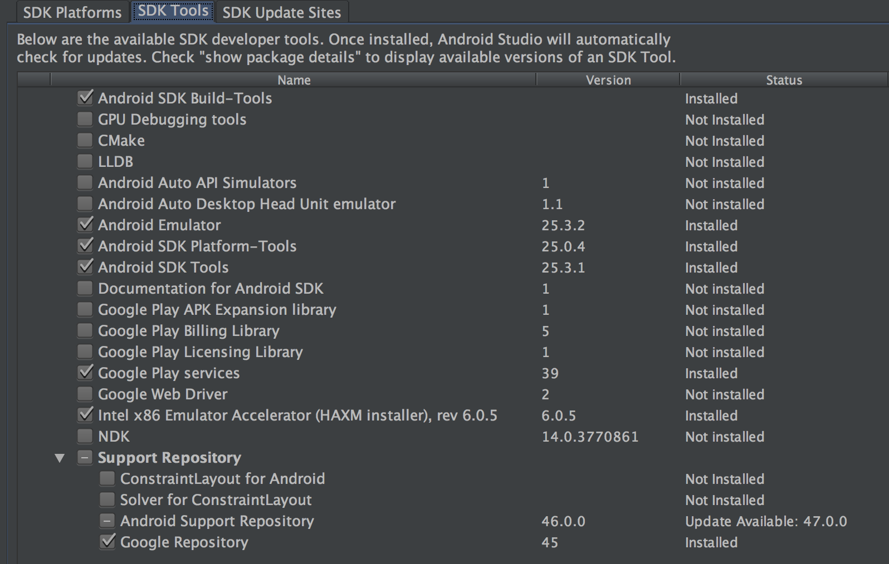
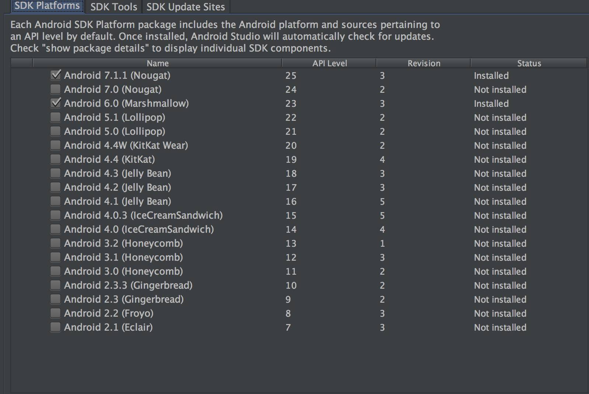

## Pre-reqs and such

1. Install node 7.0.0 [https://nodejs.org/en/download/releases/](https://nodejs.org/en/download/releases/) (or use a node version manager)

1. (*first, follow the list below for whatever platform, then fill in the gaps with this link*) react-native "getting started" [https://facebook.github.io/react-native/docs/getting-started.html](https://facebook.github.io/react-native/docs/getting-started.html) (see toggle bits at the top for OSes, etc)

1. Create a `.env` file at project root. Populate with these keys/values:

	```
	API_SERVER_URL=miss-o-and-friends.herokuapp.com
	PORT=443
	API_VERSION=v1
	FB_APP_ID=120011975127909
	PINSIGHT_IOS_ZIP=https://s3.amazonaws.com/files.pinsightmedia.com/psmsdk/PSMAdKitSDK-Public-Universal-Release-1-5.1.0-0dfb96f.zip
	ANDROID_BUILD_TOOLS_VERSION=25.0.0
	```
	Explanation of each of these variables:
	
	a. `API_SERVER_URL` is the ReST API server's IP address/domain.
	
	b. `PORT` is the ReST API server's listening port.
	
	c. `API_VERSION` is the version of the ReST API.
	
	d. `FB_APP_ID` is the registered Facebook SDK id.
	
	e. `PINSIGHT_IOS_ZIP` is the URI of the Pinsight iOS SDK zip whose `.framework` and `.bundle` will be unzipped into the required directory for the iOS-portion of this application, as part of the post-install process (see: `scripts/post_install.js`).
	
	f. `ANDROID_BUILD_TOOLS_VERSION ` *should be* the **major** Android `buildToolsVersion` that satisfies the Android project's `app/build.gradle`'s `buildToolsVersion`. Third-party react-native linked Android projects will have their `build.gradle`'s `buildToolsVersion`-s updated with this number. Required for the Android-portion of this application, as part of the post-install process (see: `scripts/post_install.js`).
	
1. Install all npm packages **globally** that are listed in the `_globals` section of the `package.json`.

	e.g. `$ npm install --global react-native-cli@2.0.1`

1. `$ npm install`

## Android pre-reqs and such

**Android project location inside this project**: `./android` (load this into Android Studio)

**Android file backup location**: `./pinsight/android/...` (**any changes to the Android project files should be backed up here**)

**Pinsight Android SDK doc location**: `./pinsight/Android_5_0_3_psm_ad_mediation_sdk_integration.pdf`

1. Install JDK 1.8 [http://www.oracle.com/technetwork/java/javase/downloads/jdk8-downloads-2133151.html](http://www.oracle.com/technetwork/java/javase/downloads/jdk8-downloads-2133151.html). Set `JAVA_HOME`, etc.

1. Install Maven 3.3.9. [https://maven.apache.org/download.cgi](https://maven.apache.org/download.cgi) or use a Maven version manager. Set `MVN_HOME`, etc. 

1. Install Android Studio [https://developer.android.com/studio/index.html](https://developer.android.com/studio/index.html).

1. In Android Studio, install Android SDK 24.4.1_1 [https://developer.android.com/studio/intro/update.html](https://developer.android.com/studio/intro/update.html).
  
  a. Screenshots of my installed Android assets, update sites, and so on:
  





	
## iOS

**iOS project location inside this project**: `./ios/MissOAndFriends.xcodeproj` (load this into Xcode)

**iOS file backup location**: `./pinsight/ios` (**any changes to the Xcode project files should be backed up here**)

**Pinsight iOS SDK doc location**: `./pinsight/iOS_5_0_3_psm_ad_mediation_sdk_integration.pdf`

*Note:* `./pinsight/ios` also contains Pinsight's (`PSMAdKitSDK`) `.framework` and `.bundle`, but these should be referenced already in the Xcode project.

1. Install Xcode [https://itunes.apple.com/us/app/xcode/id497799835?mt=12](https://itunes.apple.com/us/app/xcode/id497799835?mt=12)

## Troubleshooting

1. You may need to link the react-native libraries:
	
	`$ react-native link` (should link all but `react-native-config`)
	
	`$ react-native link react-native-config`
